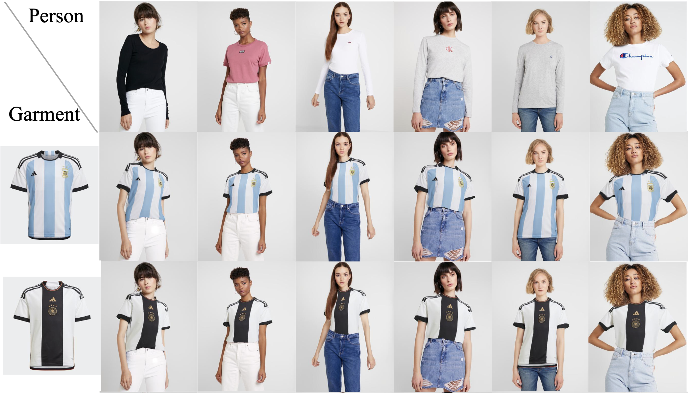

<div align="center">

<h1>GP-VTON: Towards General Purpose Virtual Try-on via Collaborative Local-Flow Global-Parsing Learning</h1>

<div>
    <a href="https://xiezhy6.github.io/" target="_blank">Zhenyu Xie</a><sup>1</sup>,
    <a href="https://github.com/xiezhy6/GP-VTON" target="_blank">Zaiyu Huang</a><sup>1</sup>,
    <a href="https://github.com/xiezhy6/GP-VTON">Xin Dong</a><sup>2</sup>,
    <a href="https://scholar.google.com/citations?user=XSf0hP4AAAAJ&hl=en" target="_blank">Fuwei Zhao</a><sup>1</sup>,
    <a href="https://sites.google.com/view/hydong?pli=1" target="_blank">Haoye Dong</a><sup>3</sup>,
</div>
<div>
    <a href="https://github.com/xiezhy6/GP-VTON" target="_blank">Xijin Zhang</a><sup>2</sup>
    <a href="https://github.com/xiezhy6/GP-VTON" target="_blank">Feida Zhu</a><sup>2</sup>
    <a href="https://lemondan.github.io/" target="_blank">Xiaodan Liang</a><sup>1,4</sup>
</div>
<div>
    <sup>1</sup>Shenzhen Campus of Sun Yat-Sen University&emsp; <sup>2</sup>ByteDance
</div>
<div>
    <sup>3</sup>Carnegie Mellon University&emsp; <sup>4</sup>Peng Cheng Laboratory
</div>

[Paper](https://arxiv.org/pdf/2303.13756.pdf) | [Project Page](https://github.com/xiezhy6/GP-VTON)
</br>

<strong>GP-VTON aims to transfer an in-shop garment onto a specific person.</strong>

<div style="width: 100%; text-align: center; margin:auto;">
    
</div>

</div>

## Fine-grained Parsing
We provide the fine-grained parsing result of the model images and in-shop garment images from two existing high-resolution (1024 x 768) virtual try-on benchmarks, namely, VITON-HD and DressCode.

We provide two version of the parsing results. One is with the original resolution (1024 x 768). Another is with the resolution of 512 x 384, on which our experiment are conducted.


|Resolution|Google Cloud|Baidu Yun|
|--------|--------------|-----------|
| VITON-HD(512 x 384) | Available soon | [Download](https://pan.baidu.com/s/1tsoaYPnevI-EsqxYZZyIbg?pwd=f9sc) |
| VITON-HD(1024 x 768) | Available soon | [Download](https://pan.baidu.com/s/1g9Wq1Oo_8GxwIax7nPve7A?pwd=kcu2) |
| DressCode(512 x 384) | Available soon | [Download](https://pan.baidu.com/s/1qJ1CPxMshaSWaMi46FA3Ww?pwd=n7hv) |
| DressCode(1024 x 768) | Available soon | [Download](https://pan.baidu.com/s/1_8bqRgakiM06EOQXjSbkaQ?pwd=yru5) |

## Environment Setup
Install required packages:

```
pip3 install -r requirements.txt
```

## Dataset
We conduct experiments on the publicly available [VITON-HD](https://github.com/shadow2496/VITON-HD) and [DressCode](https://github.com/aimagelab/dress-code) datasets with resolution of 512 x 384. For convenience, we provide all of the conditions used in our experiments in the following links.

We also provide another version with the original resolution (1024 x 768).

|Resolution|Google Cloud|Baidu Yun|
|--------|--------------|-----------|
|VITON-HD(512 x 384)|Available soon|[Download](https://pan.baidu.com/s/16oJAl_VS18gQ2XHHhKgliA?pwd=e985)|
|VITON-HD(1024 x 768)|Available soon|[Download](https://pan.baidu.com/s/1d31qoF2bXGHAeFgIb5kVzA?pwd=3tah)|
|DressCode(512 x 384)|Available soon|[Download](https://pan.baidu.com/s/19bWbO_klq_ABTTZKWmUCKg?pwd=unp4)|
|DressCode(1024 x 768)|Available soon|[Download](https://pan.baidu.com/s/1HePSYE6DEwRGnZsfbJ5ylQ?pwd=qh5g)|


## Inference

**VITON-HD**

Please download the pre-trained model from [Google Link (Available soon)]() or [Baidu Yun Link](https://pan.baidu.com/s/1gc6cH38eRxeMHD9fLj_wDQ?pwd=egpa), and rename the downloaded directory to `checkpoints` and put it under root directory of this project.

To test the first stage (i.e., the LFGP warping module), run the following command:
```
python3 -m torch.distributed.launch --nproc_per_node=8 --master_port=4739 test_warping.py \
    --name test_partflow_vitonhd_unpaired_1109 \
    --PBAFN_warp_checkpoint 'checkpoints/gp-vton_partflow_vitonhd_usepreservemask_lrarms_1027/PBAFN_warp_epoch_121.pth' \
    --resize_or_crop None --verbose --tf_log \
    --dataset vitonhd --resolution 512 \
    --batchSize 2 --num_gpus 8 --label_nc 14 --launcher pytorch \
    --dataroot /home/tiger/datazy/Datasets/VITON-HD-512 \
    --image_pairs_txt test_pairs_unpaired_1018.txt
```

To test the second stage (i.e., the try-on generator), run the following command:
```
python3 -m torch.distributed.launch --nproc_per_node=8 --master_port=4736 test_tryon.py \
    --name test_gpvtongen_vitonhd_unpaired_1109 \
    --resize_or_crop None --verbose --tf_log \
    --dataset vitonhd --resolution 512 \
    --batchSize 12 --num_gpus 8 --label_nc 14 --launcher pytorch \
    --PBAFN_gen_checkpoint 'checkpoints/gp-vton_gen_vitonhd_wskin_wgan_lrarms_1029/PBAFN_gen_epoch_201.pth' \
    --dataroot /home/tiger/datazy/Datasets/VITON-HD-512 \
    --image_pairs_txt test_pairs_unpaired_1018.txt \
    --warproot sample/test_partflow_vitonhd_unpaired_1109
```

Note that, in the above two commands, parameter `--dataroot` refers to the root directory of VITON-HD dataset, parameter `--image_pairs_txt` refers to the test list, which is put under the root directory of VITON-HD dataset, parameter `--warproot` in the second command refers to the directory of the warped results generated by the first command. Both of the generated results from the two commands are saved under the directory `./sample/exp_name`, in which `exp_name` is defined by the parameter `--name` in each command.

Or you can run the bash scripts by using the following commonds:

```
# for warping module
bash scripts/test.sh 1

# for try-on module
bash scripts/test.sh 2
```

We also provide the pre-trained model for higher resolution (1024 x 768) synthesis. Run the following commonds for inference:

```
# for warping module
bash scripts/test.sh 3

# for try-on module
bash scripts/test.sh 4
```

Note that, for higher resolution model, we only re-train the try-on module, thus the warping module is the same as that for 512-resolution synthesis.

**DressCode**

To test GP-VTON for DressCode dataset, please download the pre-trained model from [Google Link (Available soon)]() or [Baidu Yun Link](https://pan.baidu.com/s/12Q6N-FdU-nuz9Q5Er9DSQg?pwd=q2w5), and rename the downloaded directory to `checkpoints` and put it under root directory of this project.

The inference scripts are similar those for VITON-HD dataset. You can directly run the following commands:

```
## for DressCode 512
### for warping module
bash scripts/test.sh 5

### for try-on module
bash scripts/test.sh 6

## for DressCode 1024
### for warping module
bash scripts/test.sh 7

### for try-on module
bash scripts/test.sh 8

```

## Training

**VITON-HD**

To train the first stage (i.e., the LFGP warping module), run the following command:
```
python3 -m torch.distributed.launch --nproc_per_node=8 --master_port=7129 train_warping.py \
    --name gp-vton_partflow_vitonhd_usepreservemask_lrarms_1027 \
    --resize_or_crop None --verbose --tf_log \
    --dataset vitonhd --resolution 512 \
    --batchSize 2 --num_gpus 8 --label_nc 14 --launcher pytorch  \
    --dataroot /home/tiger/datazy/Datasets/VITON-HD-512 \
    --image_pairs_txt train_pairs_1018.txt \
    --display_freq 320 --print_freq 160 --save_epoch_freq 10 --write_loss_frep 320 \
    --niter_decay 50 --niter 70  --mask_epoch 70 \
    --lr 0.00005
```

To train the second stage (i.e., the try-on generator), we first need to run the following command to generate the warped results for the in-shop garments in the training set:
```
python3 -m torch.distributed.launch --nproc_per_node=8 --master_port=4739 test_warping.py \
    --name test_gpvton_lrarms_for_training_1029 \
    --PBAFN_warp_checkpoint 'checkpoints/gp-vton_partflow_vitonhd_usepreservemask_lrarms_1027/PBAFN_warp_epoch_121.pth' \
    --resize_or_crop None --verbose --tf_log \
    --dataset vitonhd --resolution 512 \
    --batchSize 2 --num_gpus 8 --label_nc 14 --launcher pytorch \
    --dataroot /home/tiger/datazy/Datasets/VITON-HD-512 \
    --image_pairs_txt train_pairs_1018.txt
```
The warped results will saved in the directory `sample/test_gpvton_lrarms_for_training_1029`. Then run the following command for training:
```
python3 -m torch.distributed.launch --nproc_per_node=8 --master_port=4736 train_tryon.py \
    --name gp-vton_gen_vitonhd_wskin_wgan_lrarms_1029 \
    --resize_or_crop None --verbose --tf_log \
    --dataset vitonhd --resolution 512 \
    --batchSize 10 --num_gpus 8 --label_nc 14 --launcher pytorch \
    --dataroot /home/tiger/datazy/Datasets/VITON-HD-512 \
    --image_pairs_txt train_pairs_1018.txt \
    --warproot sample/test_gpvton_lrarms_for_training_1029 \
    --display_freq 50 --print_freq 25 --save_epoch_freq 10 --write_loss_frep 25 \
    --niter_decay 0 --niter 200 \
    --lr 0.0005
```

Or you can run the bash scripts by using the following commonds:

```
# train the warping module
bash scripts/train.sh 1

# prepare the warped garment
bash scripts/train.sh 2

# train the try-on module
bash scripts/train.sh 3
```

To train the try-on module for higher resolution (1024 x 768) synthesis, please run the following commands:

```
# prepare the warped garment
bash scripts/train.sh 4

# train the try-on module
bash scripts/train.sh 5
```

**DressCode**

The training scripts are similar those for VITON-HD dataset. You can directly run the following commands:

```
## for DressCode 512
### train the warping module
bash scripts/train.sh 6

### prepare the warped garment
bash scripts/train.sh 7

### train the try-on module
bash scripts/train.sh 8

## for DressCode 1024
### train the warping module
bash scripts/train.sh 9

### prepare the warped garment
bash scripts/train.sh 10

```


## Todo
- [x] Release the ground truth of the garment parsing and human parsing for two public benchmarks (VITON-HD and DressesCode) used in the paper
- [x] Release the the pretrained model and the inference script for VITON-HD dataset.
- [x] Release the the pretrained model and the inference script for DressCode dataset.
- [x] Release the training script for VITON-HD dataset.
- [x] Release the training script for DressCode dataset.
- [x] Release the training/testing scripts for 1024-resolution on VITON-HD and DressCode datasets.

## Citation

If you find our code or paper helps, please consider citing:

```bibtex
@inproceedings{xie2023gpvton,
  title     = {GP-VTON: Towards General Purpose Virtual Try-on via Collaborative Local-Flow Global-Parsing Learning},
  author    = {Zhenyu, Xie and Zaiyu, Huang and Xin, Dong and Fuwei, Zhao and Haoye, Dong and Xijin, Zhang and Feida, Zhu and Xiaodan, Liang},
  booktitle = {Proceedings of the IEEE/CVF Conference on Computer Vision and Pattern Recognition (CVPR)},
  month     = {June},
  year      = {2023},
}
```

## Acknowledgments

Thanks to [PF-AFN](https://github.com/geyuying/PF-AFN), our code is based on it.


## License
The use of this code is RESTRICTED to non-commercial research and educational purposes.
